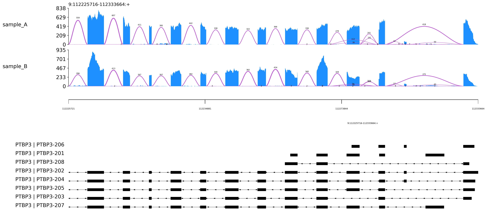
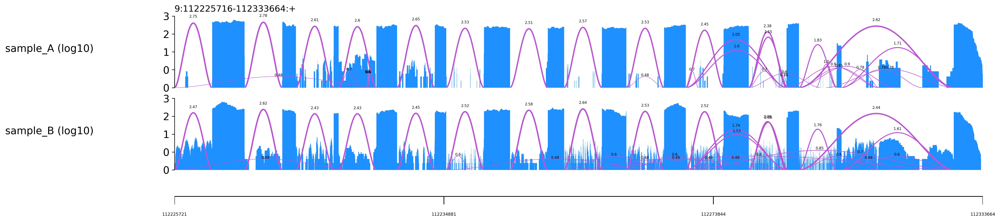
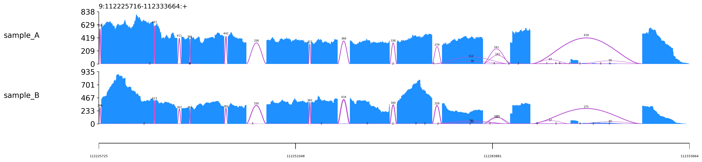

## The real Trackplot (not this repo)

Trackplot is a terrific suite of tools for the visualization of all types of next-gen sequencing data. It was developed by Yiming Zhang, Yuan Wang and colleagues. Here is the reference:

[Zhang Y, Zhou R, Liu L, et al. Trackplot: A flexible toolkit for combinatorial analysis of genomic data[J]. PLoS computational biology, 2023, 19(9): e1011477.](https://journals.plos.org/ploscompbiol/article?id=10.1371/journal.pcbi.1011477)

The actual repo for Trackplot is [ygidtu/trackplot](https://github.com/ygidtu/trackplot), where you'll find a great introduction, a link to detailed documentation, and a long array of features.

## A note of caution

This code is not intended to replace Trackplot. Installation etc. are untested. Use this code at your own risk. 

## Code in this repo

The modifications in this repo generate a specific visualization of a specific type of data, one that's surprisingly missing: a quantitative representation of splice junctions from RNA-seq on a scale as similar as possible to the coverage/depth in exons, and with introns compressed consistently. (Why does this matter? Manuscript in preparation.) Trackplot comes impressively close:
1. It can already rescale introns, so the horizontal real estate is not captive to the length of mammalian introns. Trackplot compresses all introns using the same factor (e.g. 25%), so long introns persist, but this is compensated by the option to rescaled exons separately (e.g. 10X).
2. It already draws splice-junctions as arcs, and it can display junction counts right next to those arcs. (In passing, the placement of this number was essential to the demise of the Bezier curve.)
3. It's written in Python, and the code is well-structured. (Yes, I tried other options, like [JBrowse2](https://jbrowse.org/jb2/) and [SpliceGrapher](https://splicegrapher.sourceforge.net/). No can do. Yes, I've seen [splicejam](https://jmw86069.github.io/splicejam/).)


## Modifications from Trackplot

- In density plots, splice-junction arcs are shown only as positive values, starting and ending at X=0, with their peaks corresponding to the junction counts. This features is implemented for linear and log Y-axis scales. X=0 is a bit artificial but it's key to understanding the magnitude of each arc independently. This  feature allows direct comparisons of splice-junction expression levels to each other and to exon coverage, makes it easier to understand what RNA-seq is trying to tell us. The example shows that it can eliminate the need to filter junctions. (plot_func::plot_density)
- Introns can be shown as if they all have a fixed length, e.g. 250 bp. This is akin to how Trackplot scales exons, with every base of a given type occupying the same space. Because it wasn't trivial to modify the parameters to handle this correctly, this feature is overloaded on the intron-scale option: if it's > 1, it's interpreted as the target genomic length of every intron. (plot_func::init_graph_coords).
- When `--transcripts-to-show` is specified, unwanted transcripts are dropped immediately upon reading from the GTF file. Otherwise, their coordinates linger in the alignments and take up precious space (in file/Annotation.py).

## Example

The example follows the "intron shrinkage" example from the real Trackplot (to find the link, visit [ygidtu/trackplot](https://github.com/ygidtu/trackplot) and click on "readthedocs"). There are two BAM files. Here is the output with introns fixed at 250 nt, exons unharmed (1:1), without any filtering of low-count junctions:



With --log 10, we can see all the low-count junctions:



If we use Trackplot's scaling features, we can get reasonably close (exons=20, introns=0.10):



Here is the equivalent plot with Trackplot (note the gaps remaining from excluded transcripts):


With --density-by-strand:


To be clear, the modifications described here were a small step following a giant leap forward. For instance, here is how the data looks in IGV:


## Commands

To assigned a fixed length to introns, use an intron scale greater than 1, e.g.:

```bash
--intron-scale 250
```

The switch to positive-only Y values is hard-coded, along with other preferences (transparency etc.).

To replicate the figures above, use:

```bash
trackplot \
  --intron-scale 250  \
  -e 9:112225716-112333664 \
  -r ptbp3_ext.gtf.gz \
  --show-junction-num \
  --density bam_files.tsv \
  --raster \
  --height 2 \
  --width 20 \
  --font-size 14 \
  --transcripts-to-show PTBP3-201,PTBP3-202,PTBP3-203,PTBP3-204,PTBP3-205,PTBP3-206,PTBP3-207,PTBP3-208 \
  -o PTBP3_mod_specific_transcipts.log10.png 2> PTBP3_mod_specific_transcipts.log10.png.log &
```

To scale using exising Trackplot features, use:

```bash
  --exon-scale 20 \
  --intron-scale 0.10  \
```
  
## Conclusion

Kudos to Yiming Zhang, Ran Zhou and colleagues!

